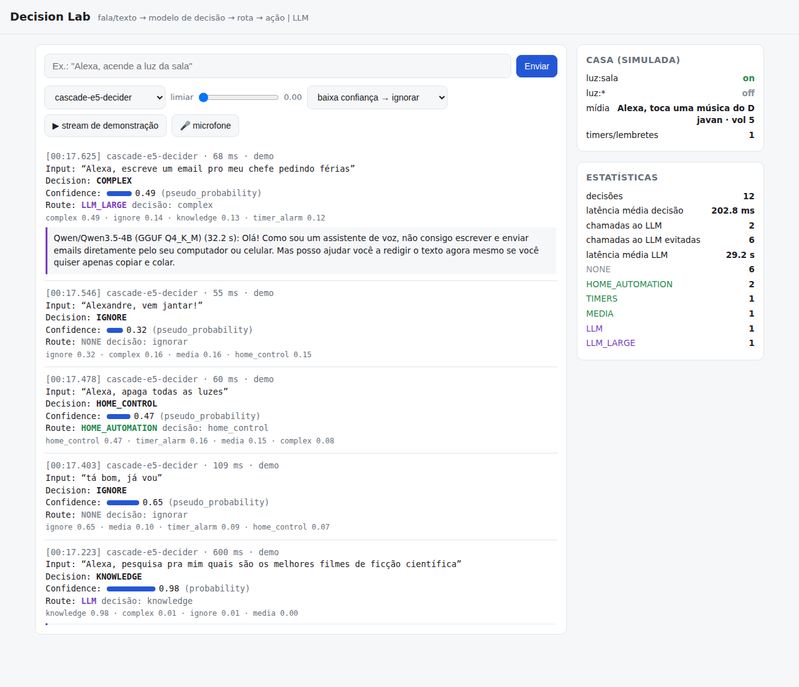

# Decision Lab — laboratório local de "semantic decision routers"

Experimento: usar um **modelo pequeno especializado em decisão** como camada rápida de interpretação e
roteamento **antes** de LLMs maiores, ferramentas ou ações — e comparar, de forma imparcial, com as
alternativas tradicionais.

```
entrada (texto / transcrição)
   │
   ▼
modelo de decisão  ──►  {decision, confidence, scores}   (POST /v1/decide)
   │
   ▼
política (limiar)  ──►  rota: NONE | HOME_AUTOMATION | MEDIA | TIMERS | LLM | LLM_LARGE | CLARIFY
   │
   ├─► executores simulados (casa, mídia, timers)
   └─► LLM local (Qwen3.5-2B / 4B via llama.cpp) só quando a rota pede
```



## Estado

**Fase 1 concluída** (critério do enunciado): entrada chega ao PC → modelo local decide → decisão volta pela
API (`/v1/decide`, `/v1/route`) e pela UI → registrada em `runs/decisions.jsonl` com latência → consumida por
outros componentes (executores da casa simulada, LLM local, UI via SSE) → benchmark comparando 18 backends.
**Fase 2 executada** (porteiro na frente de LLMs locais, medido ponta a ponta). Fases 3–5 preparadas, não iniciadas.

Principais achados (detalhes em [docs/03-resultados.md](docs/03-resultados.md)):

- A especialização em decisão vale **+31 pontos** de acurácia sobre o mesmo modelo-base (Qwen3.5-0.8B → Jeff), sem custo extra.
- O difícil não é a intenção (91–98% para os bons modelos) e sim **saber se a fala é dirigida ao assistente**:
  modelos de decisão zero-shot classificam o tema e ativam em 38–45% das falas irrelevantes.
- Na CPU, o **layout com cache de schema** (decider) foi 5,6× mais rápido que o Jeff com a mesma qualidade, e com
  latência constante de 2 a 32 opções.
- Melhor custo/benefício medido: **cascata** classificador minúsculo treinado no domínio → modelo de decisão
  (89–91% de acurácia, 6–8% de falsa ativação, ~120 ms de média nesta VM de 4 vCPUs).
- Como porteiro de LLM: 75% das chamadas evitadas, 0 perguntas perdidas; usar o próprio LLM 4B como router custa 5,6× mais tempo.

Documentação:

| Documento | Conteúdo |
|---|---|
| [docs/01-pesquisa.md](docs/01-pesquisa.md) | Etapa 1: panorama dos modelos de decisão abertos (Jeff, decider, Julia-1, Laya, Kev, OpenJev, Clef…) e alternativas |
| [docs/02-ambiente.md](docs/02-ambiente.md) | Etapa 2: o que foi instalado, comandos, arquitetura, problemas encontrados |
| [docs/03-resultados.md](docs/03-resultados.md) | Etapas 3–7: benchmarks, comparação, router + LLM, respostas às perguntas do experimento |
| [runs/bench/REPORT.md](runs/bench/REPORT.md) | Tabelas completas geradas pelos scripts |

## Uso rápido

```bash
scripts/setup.sh                    # instala tudo (venvs, llama.cpp, Jeff, modelos ~9 GB)
scripts/services.sh start all       # sobe os servidores de modelos (Jeff :8765, llama.cpp :8801-8813)
scripts/lab.sh                      # API + UI em http://127.0.0.1:8000
```

```bash
# decisão com a taxonomia padrão (assistente residencial)
curl -s localhost:8000/v1/decide -H 'content-type: application/json' \
  -d '{"input": "Alexa, acende a luz da sala"}'

# classes definidas na hora, outro backend
curl -s localhost:8000/v1/decide -H 'content-type: application/json' -d '{
  "input": "o cartão foi cobrado duas vezes", "backend": "jeff-0.8b",
  "question": "Which team should handle this?",
  "options": {"billing": "payments and refunds", "shipping": "deliveries", "tech": "bugs and login"}}'

# pipeline completo: decisão -> rota -> ação/LLM (o "segundo componente")
curl -s localhost:8000/v1/route -H 'content-type: application/json' \
  -d '{"input": "Alexa, qual a capital da Austrália?", "min_confidence": 0.5, "wait_llm": true}'
```

Outros endpoints: `GET /v1/backends`, `/v1/state` (casa simulada), `/v1/stats`, `/v1/log`, `/v1/events` (SSE).
Toda decisão é registrada em `runs/decisions.jsonl` (entrada, decisão, scores, latência, modelo, timestamp, rota).

## Trocar ou adicionar um modelo

Edite [config/backends.yaml](config/backends.yaml). Tipos disponíveis:

| tipo | o que é |
|---|---|
| `systemone` | qualquer servidor no protocolo do Jev (`POST /v1/systemone`): jeff-serve, llama-server com modelos de decisão, decider.serve, laya-serve, ollaya, ou o Jev hospedado (`api_key_env`) |
| `llm_logprob` | LLM genérico no llama-server, 1 forward, probabilidade das letras das opções (mesmo prompt do Jeff) |
| `llm_generative` | LLM genérico gerando `{"decision": ...}` com JSON schema |
| `nli`, `gliclass`, `embed_zeroshot` | zero-shot clássicos |
| `tfidf`, `embed_logreg`, `embed_knn` | classificadores treinados em `data/train.jsonl` |

## Benchmarks

```bash
.venv/bin/python -m bench.run_bench --backends jeff-0.8b,e5-logreg --perturb   # precisão, latência, CPU, calibração
.venv/bin/python -m bench.scaling --backends jeff-0.8b                          # 2 -> 32 classes dinâmicas
.venv/bin/python -m bench.cascade --first e5-logreg --second jeff-0.8b          # cascatas (offline)
.venv/bin/python -m bench.pipeline --routers jeff-0.8b --baseline               # router + LLM ponta a ponta
.venv/bin/python -m bench.report > runs/bench/REPORT.md
```

Dataset: [data/build_dataset.py](data/build_dataset.py) gera 159 falas de teste em PT-BR (58 não destinadas
ao assistente, com pegadinhas: menções à Alexa, nomes parecidos, TV ao fundo, pedidos a pessoas, erros
de transcrição) e 64 exemplos de treino separados para os baselines treináveis.

## Estrutura

```
lab/backends/   adaptadores de modelos (interface única Backend.decide)
lab/server.py   API FastAPI, log JSONL, SSE, UI
lab/router.py   política de roteamento por confiança
lab/executors.py consumidores das decisões (casa simulada, LLM local)
lab/ui/         interface de visualização em tempo real (+ microfone via Web Speech API, prévia da Fase 4)
bench/          benchmark, escalonamento, cascatas, pipeline, relatório
data/           taxonomia, dataset
config/         backends
scripts/        setup, serviços, servidor
```
